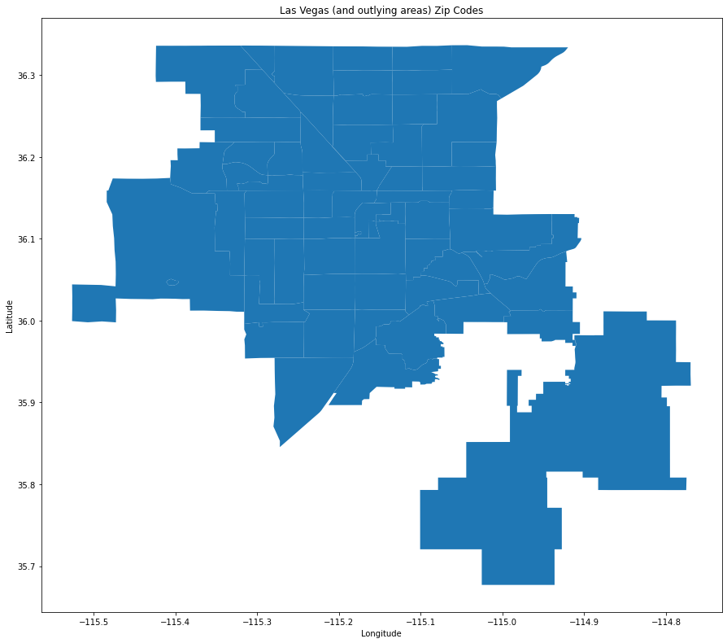
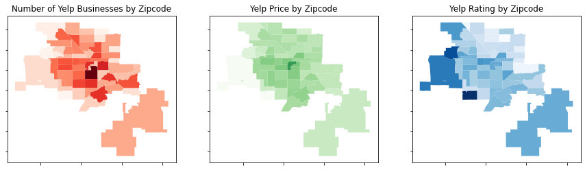

# Patrick S. Flynn - Data Incubator Capstone 

## Summary
The purpose goal of this project is to analyze the importance of a given yelp restaurant's geographic location in the greater Las Vegas valley (Las Vegas, Henderson, North Las Vegas, Green Valley, and Boulder City). In addition to geographic location we will also analyze any particular types of restaurant (i.e. Korean BBQ, Chinese, Italian) to determine if we can say with some degree of certainty that planning a new restaurant in a given zip code will be more likely to fail or succeed.

## Project Goals
- Identify trends regarding what restaurants/restaurant types do well in a given zip code in the greater Las Vegas area
  
- Be able to recommend a restaurant type (or combination of types) given a particular zip code that will be more likely to succeed (i.e. high number of "good" ratings)

## Datasets
### Greater Las Vegas Area Zip Code Shapefile

Source: [ESRI Arcgis](https://hub.arcgis.com/datasets/ccgismo::zip-codes)
 
In order to be able to visually identify zip codes in the greater Las Vegas area we need the corresponding shapefiles provided by the Clark County GISMO team via ESRI ArcGIS hub technology. We are able to then ingest this information into Python via Geopandas and visualize the zip codes as seen above.

### Yelp API
Source: [Yelp API](https://www.yelp.com/developers/documentation/v3/get_started)

## Methodology
#### Requirements
- Python 3.X
- Package/Environment:
  - Anaconda Environment (Numpy, Pandas, SKlearn, etc.)
  - Geopandas/Shapely/Descartes

### Steps
1. Ingest the zip code shapefile as a Geopandas DataFrame
   - We also remove some zip codes that are essentially vast open desert
2. We obtain the latitude/longitude boundaries (minimum, maximums) and we construct a fishnet grid comprised of coordinates centroid points. (see below image)=

3. We spatially join ALL of the centroids to the zip code shapefile and we remove any centroids that are not within the selected zip codes, resulting in over 1000 (1117 to be exact) coordinate pairs.
4. We iterate through each centroid coordinate pair passing in the coordinate to the yelp API as a HTTP request, receiving back a dataset of 50 or less business for each centroid.
5. We remove any duplicate business IDs that may have been retrieved in low density areas.
6. We apply a SKlearn multilabel binarizer to turn all of the individual categories of a business (such as "Seafood" or "Burger") into a unique one-hot-encoded set of columns
7. In order to stay under our alloted API requests, we cache the results of our API requests into a SQLite database stored within the repository allowing us to easily access the almost 5000 businesses without having to send an API request for each of the centroids again
## Exploratory Data Analysis

As a proof of concept and viability assessment for this project we do some transformations of our data and plot them geographically as seen above. The results are perhaps not what I was expecting to see, I expected that the higher the prices, the better the ratings would be. After plotting the results we can see that this is in fact not the case and instead we see a high concentration of businesses along the Las Vegas strip which is to be expected, however most of the well rated restaurants are on the West side of the valley or in Boulder City (South East). The prices are located centrally in the valley which makes sense as this is where many of the high-end luxury restaurants are located on the Las Vegas Strip. 

## Next Steps
Our initial EDA serves as a good first step but there is much work to be done! In order to understand at a deeper level what is going on we need to obtain some economic data to see how economic status is distributed across the zip codes as well as some qualitative data in the form of written user reviews to better understand what is going on.

- Locate socioeconomic information for potential use in ML training model
- Query Yelp API for more in depth location about each business such as hours of operation or written user reviews.